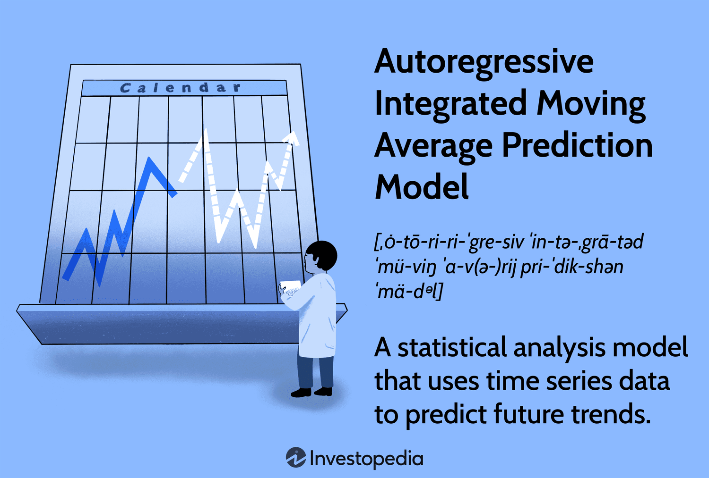

# Gold Price Prediction using ARIMA

This repository contains code and resources for predicting the future price of gold using the ARIMA (Autoregressive Integrated Moving Average) model. The ARIMA model is a widely used time series analysis technique that incorporates autoregression, differencing, and moving average components.

## Project Highlights

- **Data**: The project utilizes historical gold price data obtained from reliable sources. The dataset includes features such as the date, opening price, high price, low price, closing price, change in pips, and percentage change.

- **ARIMA Model**: The ARIMA model is created and trained using the historical gold price data. The optimal values for the ARIMA parameters (p, d, q) are determined through techniques like grid search or auto-correlation plots.

- **Data Split**: The dataset is split into training and testing sets, with approximately 70-80% of the data used for training the model, and the remaining data used for evaluating the model's performance.

- **Model Evaluation**: The performance of the ARIMA model is assessed using common evaluation metrics such as Mean Absolute Error (MAE), Mean Squared Error (MSE), and Root Mean Squared Error (RMSE).

- **Prediction and Visualization**: The trained ARIMA model is used to make predictions on the test data. The predicted gold prices are then compared with the actual prices. The results are visualized through line charts to provide a clear understanding of the model's performance.

